<div align="center">

# CycleIQ

**A private period & symptom tracker for regular cycles, PCOS, PCOD, endometriosis and perimenopause.**
Everything stays on your phone — no account, no cloud, no trackers.

[](https://github.com/itisar-345/CycleIQ/actions/workflows/ci.yml)
[](LICENSE)


[](CONTRIBUTING.md)

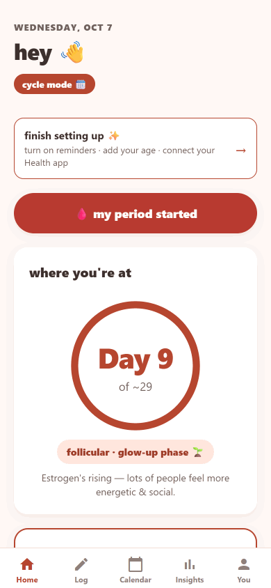
&nbsp;&nbsp;&nbsp;
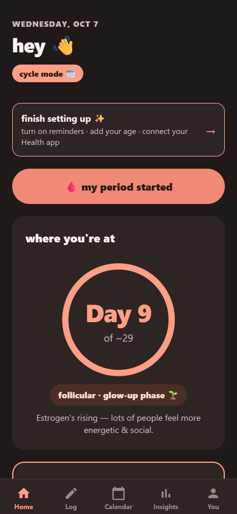

</div>

---

## Why CycleIQ?

Most period apps send your most sensitive health data to a server. CycleIQ doesn't have one. Your logs live in an encrypted database on your device, and the predictions and pattern-finding run there too.

It's built for people whose cycles don't fit a 28-day template: honest prediction windows for irregular cycles, condition-specific tracking, and reports you can actually take to a doctor.

## Features

- **Predictions that show their uncertainty.** A next-period date, a likely window and a confidence score, all calibrated by back-testing the model on your own history ([how it works](docs/PREDICTION_ENGINE.md)).
- **A 30-second daily log.** Mood, pain, energy, sleep, stress, flow and lifestyle. Skip anything you like; unanswered questions are never filled in for you.
- **Condition modes.** PCOS, PCOD, endometriosis (with flare mode) and perimenopause each get their own questions, priors and insights. There's also a post-pill mode that holds predictions back for about 90 days.
- **Personal patterns.** Correlations between your own symptoms (e.g. *stress ↔ mood*), with multiple-testing correction so you don't see noise.
- **Calendar.** Period, predicted window, pain heat-map and cycle phases, with a detail view for every day.
- **Doctor-ready reports.** PDF summaries and appointment prep.
- **Privacy you can check.** An SQLCipher-encrypted database, AES-256-GCM for free-text notes, app lock (Face ID / fingerprint / passcode), discreet notifications, export and one-tap delete.
- **Your voice.** *Chill* (casual, lowercase) or *classic* (plain, calm) wording across the whole app, including notifications.
- **Clean, consistent icons.** [Lucide](https://lucide.dev) line icons throughout, with no emoji in the interface.
- **Accessible.** WCAG AA contrast in light and dark, screen-reader labels throughout, 44pt touch targets, and support for Reduce Motion.
- **Gentle safety prompts.** Signposting (never diagnosis) after several very low mood days or a run of severe endometriosis pain. These are pending clinical review ([details](docs/CLINICAL_REVIEW.md)).

## Screenshots

| Home | Log | Calendar | Insights | You |
|:---:|:---:|:---:|:---:|:---:|
| 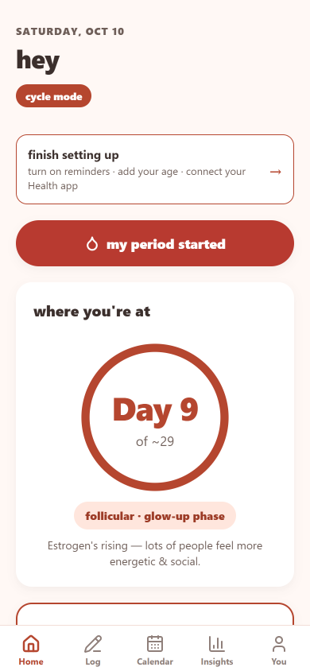 | 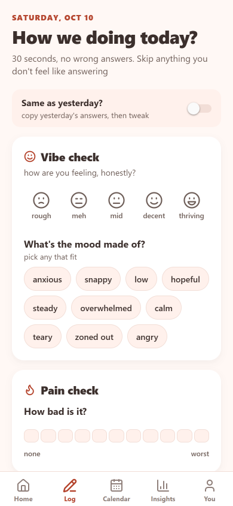 | 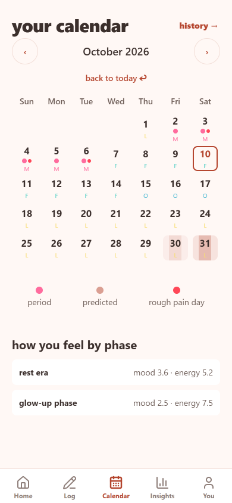 | 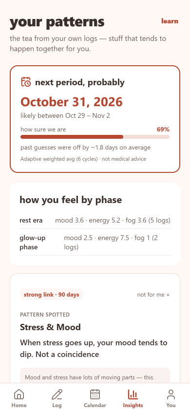 | 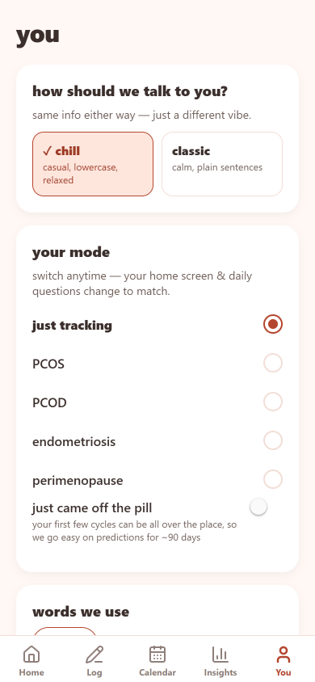 |
| 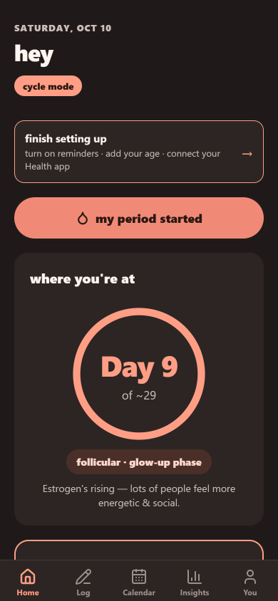 | 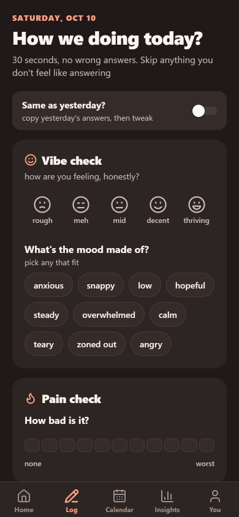 | 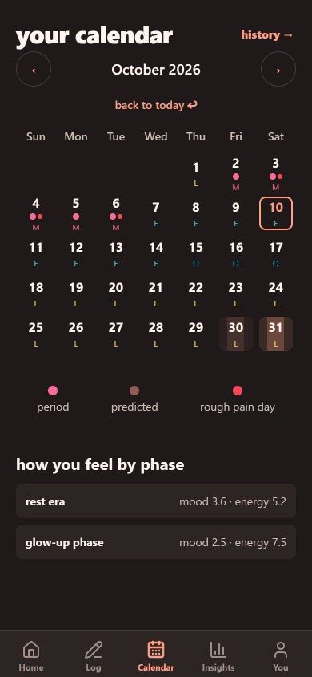 | 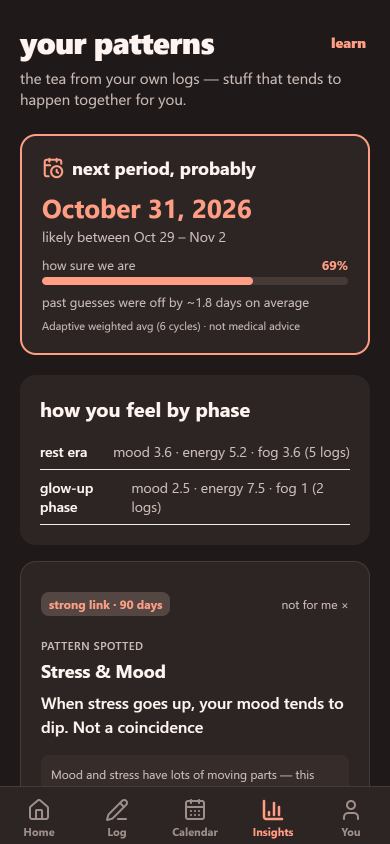 | 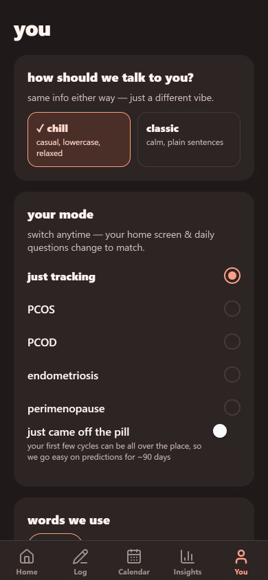 |

<details>
<summary>Onboarding</summary>

| Welcome | First prediction |
|:---:|:---:|
| 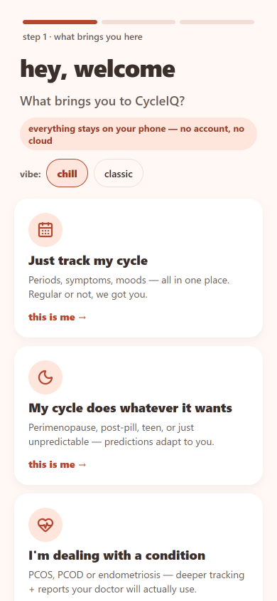 | 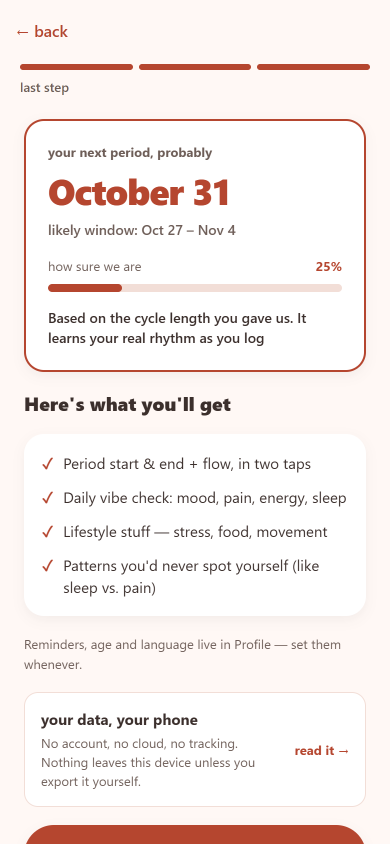 |

</details>

<sub>Screenshots use generated sample data from the web preview (`npm run screenshots`).</sub>

## Getting started

**Requirements:** Node 20+, npm, and either a phone with [Expo Go](https://expo.dev/go) or an iOS Simulator / Android emulator.

```bash
git clone https://github.com/itisar-345/CycleIQ.git
cd CycleIQ
npm install
npx expo start          # press i (iOS), a (Android), or scan the QR code with Expo Go
```

> **Expo Go vs. a development build.** Expo Go runs the full app, but with a plaintext database and without Apple Health / Health Connect import (Profile says so). SQLCipher encryption, health import and Face ID unlock on iOS need a development build:
> `npx expo run:ios` / `npx expo run:android`, or `eas build --profile development`.

### Try it in the browser

```bash
npm run web:demo        # web preview filled with sample data
```

The web preview runs the real database code on [sql.js](https://sql.js.org) (SQLite in WebAssembly) **in memory only**. Nothing is saved and nothing is encrypted, so it's for previewing and development, not for tracking. It loads sql.js from jsDelivr, so it needs a connection. Use `npm run web` for an empty preview.

## Testing

```bash
npm run check           # typecheck + lint + every test (what CI runs)
npm test                # prediction & statistics unit tests, backtest gate, database tests on real SQLite
npm run test:ui         # screen tests (Jest + React Native Testing Library) incl. accessibility checks
npm run backtest        # prediction accuracy vs. simple baselines
APP_ID=<bundle id> npm run e2e   # Maestro flows on a device or simulator build
npm run screenshots     # regenerate docs/screenshots (needs Chrome)
```

Database tests run the real `database/` modules against SQLite through an expo-sqlite stand-in (`tests/support/`), which also rejects SQL that device builds don't support.

## How it's built

| Layer | Tech |
|---|---|
| App | Expo SDK 54, React Native 0.81, React 19, Expo Router (typed routes) |
| Icons | lucide-react-native |
| State | Zustand, persisted through an AES-256-GCM encrypted storage adapter |
| Data | expo-sqlite with SQLCipher on device; sql.js in the web preview |
| Crypto | @noble/ciphers (AES-GCM), keys in Keychain / Keystore via expo-secure-store |
| Health | Apple HealthKit and Android Health Connect (read-only sleep & activity) |
| Tests | tsx + node:assert, Jest + RNTL, Maestro, GitHub Actions |

More detail: [Architecture](docs/ARCHITECTURE.md) · [Prediction engine](docs/PREDICTION_ENGINE.md)

```
app/            Screens (Expo Router): (tabs)/, onboarding/, cycle/[id]/, reports, privacy
components/     Shared UI: log inputs & sections, date field, app lock, loading
constants/      Theme tokens, copy in both voices, safeguarding thresholds
database/       SQLite layer: schema & migrations, cycles, symptoms, predictions, insights
store/          Zustand app state
utils/          Prediction engine, statistics, notifications, reports, encryption, health bridges
tests/          Unit, backtest, database and UI tests
scripts/        Screenshot generator, web demo launcher
docs/           Architecture, prediction engine, release QA, clinical & regulatory packs
```

## Documentation

| | |
|---|---|
| [Architecture](docs/ARCHITECTURE.md) | Layers, data model, boot sequence, privacy design |
| [Prediction engine](docs/PREDICTION_ENGINE.md) | Tiers, calibration, backtest results |
| [Contributing](CONTRIBUTING.md) | Setup, conventions, the two-voice copy system, PR checklist |
| [Feature checklist](CycleIQ-Feature-Checklist.md) | Everything built and what's still open |
| [Clinical review](docs/CLINICAL_REVIEW.md) | Safety prompts awaiting clinician sign-off |
| [Device QA plan](docs/QA_DEVICE_TEST_PLAN.md) · [Accessibility audit](docs/ACCESSIBILITY_AUDIT.md) | Release testing that needs real devices |
| [Regulatory brief](docs/REGULATORY_BRIEF.md) · [Store submission](docs/STORE_SUBMISSION.md) | Pre-launch packs |
| [User research guide](docs/USER_RESEARCH_GUIDE.md) | Running sessions with PCOS and endometriosis communities |

## Roadmap

- [ ] Clinical sign-off for safety prompts ([review pack](docs/CLINICAL_REVIEW.md))
- [ ] Legal review of medical-device and children's-privacy questions ([brief](docs/REGULATORY_BRIEF.md)); teen mode stays off until then
- [ ] Device and screen-reader testing on iOS 16+ and Android 10+
- [ ] App Store and Google Play release

Have an idea? [Open a feature request](https://github.com/itisar-345/CycleIQ/issues/new/choose).

## Contributing

Contributions of every size are welcome: bug reports, ideas, docs and code. Read [CONTRIBUTING.md](CONTRIBUTING.md) to get set up, and please follow the [Code of Conduct](CODE_OF_CONDUCT.md).

Found a security or privacy problem? Please report it privately, as described in [SECURITY.md](SECURITY.md).

## Disclaimer

CycleIQ is not a medical device and does not provide medical advice, diagnosis or treatment. Predictions are estimates and **must not be used for contraception**. If you're worried about your health, talk to a healthcare professional.

## License

[MIT](LICENSE) © itisar-345 and CycleIQ contributors
